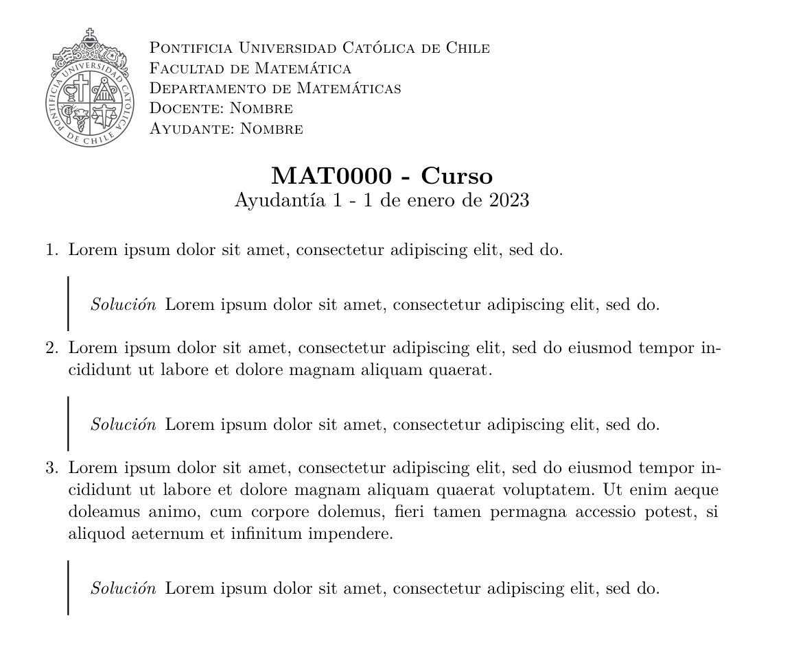

*Fork del [repositorio de Wh4rp](https://github.com/Wh4rp/Typst-PUC)*

Hay ligeras modificaciones como 

- Smallcaps para el encabezado
- Basta con los nombres para `ayudante` y `docente`
- Modificación a la presentación de las soluciones
- Tipo de letra `New Computer Modern` utilizada en `LaTeX`.

Aún queda pendiente un mejor manejo de la enumeración 


# Template para ayudantías PUC


Este repositorio contiene un template para ayudantías de la PUC en [Typst](https://typst.app/).

## ¿Cómo usarlo?

El modulo de template está en la carpeta `modules`. Copia dicha carpeta en tu proyecto y crea tu archivo typst más o menos así:

```yaml

#import "modules/template.typ": *

#show: doc => project(
    curso: (
        sigla: "MAT0000",
        nombre: "Curso",
        departamento: "Departamento de Matemáticas",
        escuela: "Facultad de Matemática",
    ),
    docente: "Nombre",
    ayudante: "Nombre",
    numero_de_ayudantia: 1,
    fecha: "1 de enero de 2023",
    body: doc
)

#enum[

// Espacio para la pregunta 1
#lorem(10)

#solucion[
#lorem(10)
]

][
// Espacio para la pregunta 2
#lorem(20)

#solucion[
#lorem(10)
]

][
// Espacio para la pregunta 3
#lorem(40)


#solucion[
#lorem(10)
]

]

```



## Módulos utilizados

- [typst-theorems](https://github.com/sahasatvik/typst-theorems)
